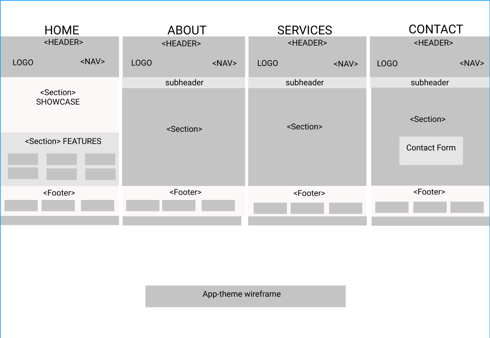

# Development Strategy

> `App-theme` Project

* Recreating a fictional website for learning purpose based on Traversy's Media tutorial.
* Build with HTML5, CSS3 & Flexboxgrid
* The main idea of the project is to practice of collaboration on Github.

## Wireframe

<!-- include a wireframe for your project in this repository, and display it here -->
<!-- wireframe.cc is a good site for getting started with wireframes -->

## 0. Set-Up

__A User can see my initial repository and live demo__

### Repo

* Generate from Template
* Write initial, basic README
* Turn on GitHub Pages
* Adding wireframe

## 1. Make the header

### Repo
1. Develope locally on a branch called `header`
2. Make changes and commit
3. Make a pull request to `master`
4. Merge changes to `master`

### HTML
* Create `<header>`element
* Create `<nav>`element (`Home`, `About`, `Services`, `Contact`)
* Using Flexbox grid
* Create `subheader`for `About`, `Services`, `Contact`

### CSS

* Make the CSS folder
* Layout styling for `<header>` and  `<nav>`

## 2.Make the Section Showcase and Features

### Repo
1. Develope locally on a branch called `section`
2. Make changes and commit
3. Make a pull request to `master`
4. Merge changes to `master

### HTML

* Create first `<section>` `showcase` (add description paragraph of the webpage)
* Create second `<section>` `features`(add features of the company)
* Add the icon elements for the features of the company
* Download `font-awesome.css`stylesheet
* Add the icon elements and iphone image for `features`
* Make a form in `Contact`for users to contact the company by email

## CSS

* Add background image for `showcase`
* Add `font-awesome.css` file in the CSS folder
* Add background for `features`
* Styling the `showcase` and `features`
* Apply `media queries`to enable webpage content to adapt to different screen size and resolutions

## 3. Make the Footer
1. Develope locally on a branch called `footer`
2. Make changes and commit
3. Make a pull request to `master`
4. Merge changes to `master

## HTML

* Create `<footer>`
* Add paragraph with short information about the company
* Create input button to subscribe newsletter

## CSS

* Styling `<footer>`

## Finishing Touches

- Write final, complete README
